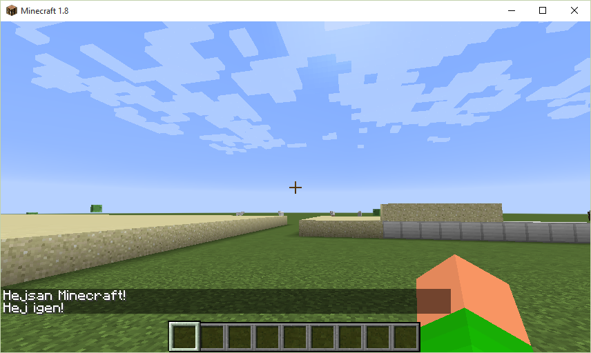
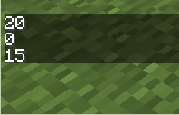
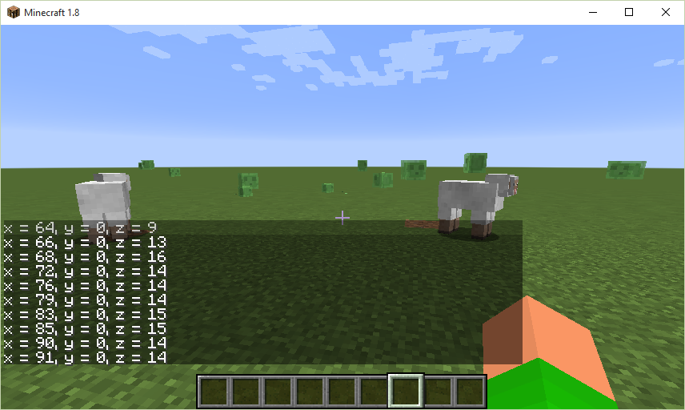
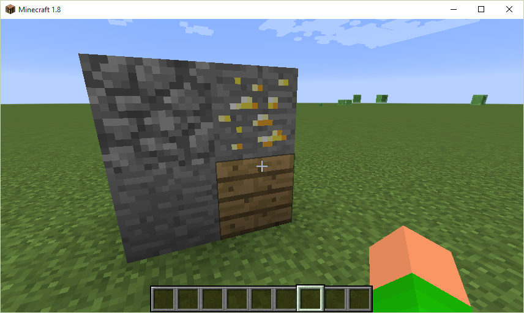
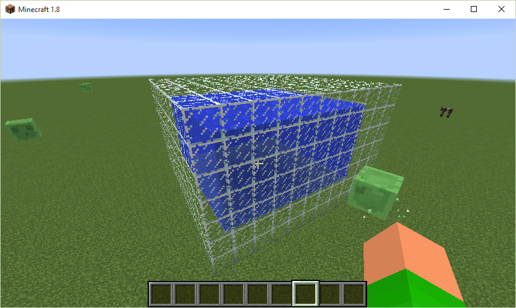
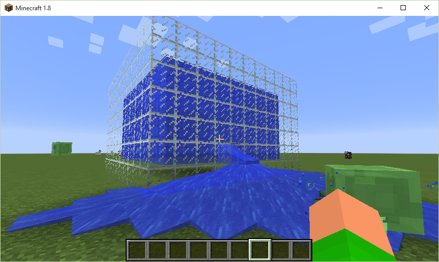
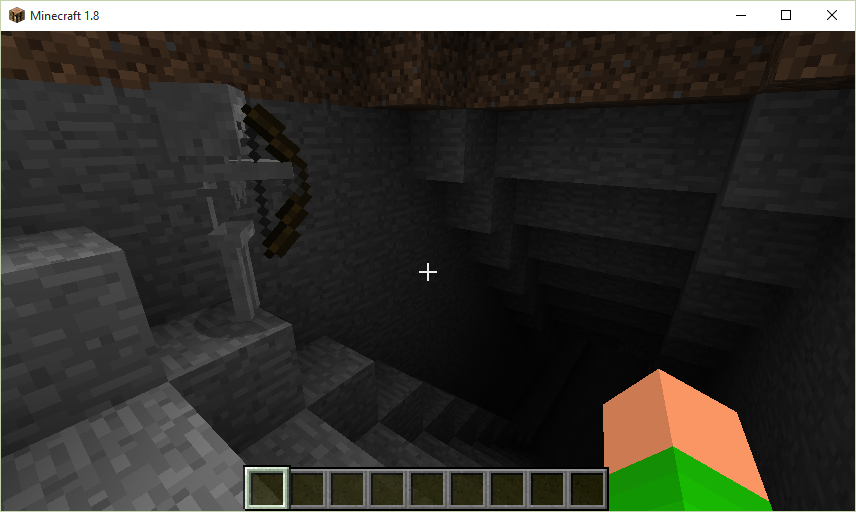
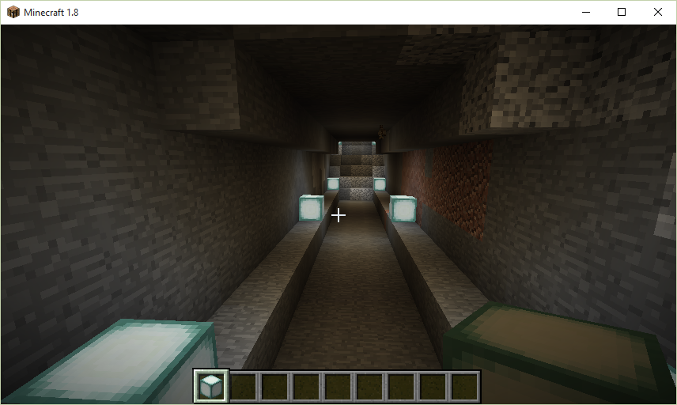
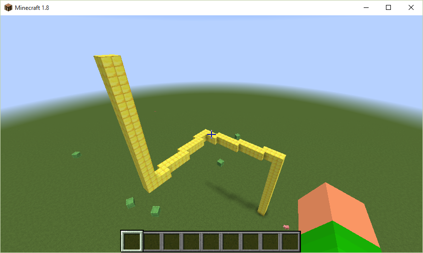

# Koda i Minecraft

## Vad är programmering

En dator är uppbyggd kring ett antal delar som samarbetar för att du ska kunna använda program, spela spel och titta på bilder. Den viktigaste delen är processorn eller central processing unit (CPU). Processorn är expert på att utföra instruktioner, som t ex beräkna summan av 2+2, fyll minnet med text eller rita linjer på skärmen. Den andra viktiga delen i datorn är minnet. Minnet används för att lagra de instruktioner som ska utföras av processorn samt information som används för att visa text, grafik och video på skärmen. Ett antal av dessa instruktioner som tillsammans utför en uppgift kallar man ett program eller en applikation. 

De instruktioner som processorn utför kallas för maskininstruktioner och är mycket komplicerade att skriva. För att göra det enklare använder man istället någon form av programmeringsspråk, som använder instruktioner som är enklare för oss att skriva och förstå. Dessa instruktioner översätts med hjälp av ett speciellt program som kallas kompilator eller översättare till maskininstruktioner.
 
Instruktioner skrivna i ett programmeringsspråk kallas tillsammans för programkod eller källkod. Programkoden skrivs ofta i en texteditor eller en speciell utvecklingsmiljö som kopplar ihop en texteditor med en kompilator.
 
För att få datorn att göra något använder vi oss av något som kallas funktioner eller kommandon. Dessa talar om för datorn vad vi vill göra. Ett typiskt kommando eller funktion i Python består av 2 delar, funktionsnamnet och indata till funktionen (...). Följande exempel visar hur vi kan skicka ett meddelande till chatt-fönstret i Minecraft.
 
	minecraft.postToChat("Hejsan Minecraft!")

**minecraft.postToChat** är funktionsnamnet, **("Hejsan Minecraft!")** är indata till kommandot. 

Genom att sätta ihop flera instruktioner talar man om för datorn hur den ska utföra en uppgift på samma sätt som instruktionerna i recepten i kokboken. I nästa exempel lägger vill 2 kommandon till. Ett kommando, **sleep(5)**, anger att programmet ska vänta i 5 sekunder och ett kommando som skriver ut "Hej igen!" i chatt-fönstret:

	minecraft.postToChat("Hejsan Minecraft!")
	sleep(5)
	minecraft.postToChat("Hej igen!")

Kör man programmet igen kommer följande upp i Minecraft:

## Anpassa Minecraft

För att det ska bli lättare att programmera med Minecraft kan det vara bra att stänga av funktionen i Minecraft som pausar programmet när man byter program i Windows. Detta görs genom att trycka på **F3 + P**. När detta är gjort tryck en kort gång på **F3** för att ta bort informationstexten. Tryck **F3 + P** igen för att återställa Minecraft inställningen igen.

Många egenskaper i Minecraft går att styra ifrån chattfönstret. Detta fönster öppnas genom att trycka på T. Några bra kommandon man kan skriva i detta är:

 - **/time set day** - Återställer tiden till morgon (10:00)
 - **/weather clear** - Fint väder 
 

## Mitt första Minecraft program

Vi ska nu skapa vårt första Minecraft program i Python. Skapa en ny Python-fil i IDLE eller i Python för Minecraft Editorn. 

Det första vi måste göra i vårt program är att tala om för Python att vi behöver kommandon för att prata med Minecraft, samt kommandon för att kunna göra pauser i programkörningen. Skriv in följande rader i editorn. 

	from mc import *
	from time import *

I nästa steg skapar vi kopplingen till Minecraft. 

	minecraft = Minecraft()

Detta gör att vi får tillgång till Minecraft genom en objektet, minecraft. minecraft-objektet innehåller alla de kommandon som behövs för att styra Minecraft, t ex genom att lägga till följande kommandon:

	minecraft.postToChat("Hejsan Minecraft!")
	sleep(5)
	minecraft.postToChat("Hej igen!")
 
Det kompletta programmet ser ut så här:

	from mc import *
	from time import *
	
	minecraft = Minecraft() 
	
	minecraft.postToChat("Hejsan Minecraft!")
	sleep(5)
	minecraft.postToChat("Hej igen!")

----------
### Övning 1

Modifiera programmet så att det skriver ut fler meddelanden i chattfönstret. Vad händer om man ändrar siffran i sleep(..) kommandot?

----------

## Var är jag någonstans?

Om vi skall bygga och skapa saker i Minecraft kan det vara bra att veta var man är någonstans. I Minecraft bestäms detta av ett så kallat koordinatsystem med 3 axlar, X, Y och Z. Det går att se var man befinner sig i detta koordinatsystem genom att trycka på **F3**.  

XYZ: anger var spelaren befinner sig i världen. I bilden befinner sig spelare i position (X = -310, Y =  4, Z = 478). X och Z anger var spelaren befinner sig längs marken. Y anger på vilken höjd spelaren befinner sig.

I programkoden kan man ta reda på spelarens position med följande kommando:

	pos = minecraft.player.getTilePos()

Kommandot minecraft.player.getTilePos frågar Minecraft var spelaren befinner sig för tillfället. Vi får tillbaka en s.k. variabel, **pos** som innehåller spelarens position. 

> **Variabler** - I början av denna text pratade vi om hur datorn lagrar program och information i minnet. I program behöver vi också ofta lagra information, som t ex siffror, text och grafik i minnet för att kunna hämta tillbaka det när vi behöver det. I de tidigare exemplen har vi angett siffror direkt till funktionerna. Många gånger har vi också angett samma siffra många gånger. För att förenkla hanteringen av information i program använder man sig av variabler. Variabler kan liknas vid en låda i en byrålåda med en etikett på. I lådan kan vi lägga olika saker. Etiketten gör det lätt att hitta sakerna i lådan igen. I datorns värld anger en variabel en plats i minnet. Namnet på variabeln är etiketten som gör att vi kan hitta tillbaka till denna minnesplats igen.

**pos** innehåller spelarens X, Y och Z position i förhållande till den position man startade i världen. Vi kan skriva ut innehållet i dessa till chattfönstret med följande kommandon:

	minecraft.postToChat(pos.x)
	minecraft.postToChat(pos.y)
	minecraft.postToChat(pos.z)

I Minecraft visas då 

i chattfönstret. 20 är vår position i x-led, 0 är positionen i y-led och 15 är vår position i z-led.

Det kompletta programmet visas i följande listning:

	from mc import *
	
	minecraft = Minecraft()
	
	pos = minecraft.player.getTilePos()
	
	minecraft.postToChat(pos.x)
	minecraft.postToChat(pos.y)
	minecraft.postToChat(pos.z)
    
----------
### Övning 2

Prova att gå till olika ställen i Minecraft för att se hur det påverkar X, Y och Z värdena i **pos** variabeln.

----------

Vi kan skriva ut spelarens position på ett mer elegant sätt genom att ändra de tre tidigare kommandona till ett enda kommando:
 
	minecraft.postToChat("x = " + str(pos.x) + ", y = " + str(pos.y) + ", z = " + str(pos.z))

I det ovanstående kommadot använder vi + för att slå ihop flera texter. str(...) översätter siffror till text.

## Enkel upprepning

Många gånger när man skriver program måste man upprepa kommandon många gånger. För att göra det enklare kan vi instruera datorn att hela tiden upprepa vissa kommandon. Detta kallas ofta för att man skapar loopar. Vi skall nu modifiera vårt program att med jämna mellanrum skriva ut spelarens position i chattfönstret. I exemplet skall vi använda en s.k. while-sats. Denna upprepar kommandon tills dess att ett visst villkor inte är uppfyllt längre. Vi skriver in följande:

	while True:
	    sleep(1)
	    pos = minecraft.player.getTilePos()
	    minecraft.postToChat("x = %g, y = %g, z = %g" % (pos.x, pos.y, pos.z))

Kommandon som skall upprepas måste vara indragna i förhållande till while-satsen. While-satsen måste också avslutas med ett : för att indikera var de upprepade kommandona börjar. **sleep(1)** anger att programkörningen skall pausa i 1 sekund. Övriga kommandon tar reda på spelarens position och skriver ut denna i chattfönstret. Om allt fungerar visas följande i chattfönstret:

Tänk på att detta program aldrig stannar, så att vi måste trycka på stopp-knappen i editorn eller Ctrl-C i IDLE.

Det kompletta programmet visas i följande listning:

	from mc import *
	from time import *
	
	minecraft = Minecraft()
	
	while True:
	    sleep(1)
	    pos = minecraft.player.getTilePos()
	    minecraft.postToChat("x = %g, y = %g, z = %g" % (pos.x, pos.y, pos.z))

## Skapa block

Block skapas Minecraft med kommandot **setBlock(..)** Indata till kommandot är positionen in X, Y och Z samt blockets id. För att sätta ut ett stenblock anger man följande kommando:

	pos = minecraft.player.getTilePos()

	minecraft.setBlock(pos.x+3, pos.y, pos.z, STONE.id)

Detta sätter ut ett block av typen STONE.id 3 block från spelaren i X-led och på samma höjd som spelaren. Vi kan nu skapa fler block genom att lägga till fler kommandon:

	pos = minecraft.player.getTilePos()
	
	minecraft.setBlock(pos.x+3, pos.y, pos.z, STONE.id)
	minecraft.setBlock(pos.x+3, pos.y+1, pos.z, COBBLESTONE.id)
	minecraft.setBlock(pos.x+3, pos.y, pos.z+1, WOOD_PLANKS.id)
	minecraft.setBlock(pos.x+3, pos.y+1, pos.z+1, GOLD_ORE.id)

Man kan använda bläddraren i editorn för att klistra in block i koden. Välj ett block i lista n och klicka sedan **Lägg till** enligt följande figur:

Det går att skapa många block på en gång genom att använda kommandot **setBlocks**. I detta kommando kan man ange start och slut position mellan vilka blocken skall placeras. I följande kommandon sätter vi ut lövblock från (X + 10, Y, Z + 10) - (X + 20, Y + 4, Z + 20):

	pos = minecraft.player.getTilePos()
	
	minecraft.setBlocks(pos.x + 10, pos.y, pos.z + 10, pos.x + 20, pos.y + 4, pos.z + 20, LEAVES.id)

Det går också att sätta ut luftblock AIR.id och vatten block, WATER.id, på detta sätt. I följande exempel bygger vi ett akvarie genom att först skapa block av glas och sedan fylla den inre delen av detta block med vatten:

	pos = minecraft.player.getTilePos()
	
	minecraft.setBlocks(pos.x - 20, pos.y, pos.z - 20, pos.x - 10, pos.y + 6, pos.z - 10, GLASS.id)
	minecraft.setBlocks(pos.x - 19, pos.y + 1, pos.z -19, pos.x - 11, pos.y + 5, pos.z -11, WATER.id)

Att det är vatten kan vi se om vi slår i sönder ett av fönsterblocken:

----------
### Övning 3

Prova att skapa ett hus av sten eller något annat material och sedan gröpa ur det genom att skapa luftblock inuti.

----------

## Använda sköldpaddsgrafik (turtle) i Minecraft

För att göra det lättare att skapa och ta bort block kan man använda en s.k. sköldpadda med en 3D penna för att skapa block eller ta bort block. Tunnlar i Minecraft kan vara jobbiga att göra för hand. Med hjälp av sköldpaddan kan vi snabbt och enkelt borra hål i vår värld precis som när man skapar riktiga tunnlar. Följande exempel visar hur vi gräver en 5 block bred tunnnel ner i marken och sedan upp igen:

	from mc import *
	from mcturtle import *
	
	minecraft = Minecraft()
	
	turtle = Turtle()
	
	turtle.pendelay(0)         # Anger hur om uppritningen skall ske långsamt eller snabbt 
	material = AIR             # Variabel för materialet som skall användas
	turtle.penwidth(5)         # Tjocklek på "pennan"
	turtle.penblock(material)  # Sätt pennans material
	turtle.pendown()           # Börja gräva
	turtle.down(45)            # 45 grader nedåt
	turtle.go(20)              # 20 block framåt
	turtle.up(45)              # 45 grader uppåt
	turtle.go(20)              # 20 block framåt
	turtle.up(45)              # upp 45 grader
	turtle.go(20)              # 20 block framåt
	turtle.penup()             # Avsluta ritandet

Om programmet körs skapas nu en tunnel ner i marken:

Påväg ner i tunneln.

Nere i tunneln. Lamporna är tillagda i efterhand.

Påväg upp.

I det tidigare exemplet använde vi tomma block, AIR.id, för att skapa tunnlar. Vi kan också skapa strukturer med sköldpaddan. I följande exempel skapar vi en skulptur av GOLD_BLOCK.id.

	from mc import *
	from mcturtle import *
	
	minecraft = Minecraft()
	
	turtle = Turtle()
	
	turtle.pendelay(0)
	material = GOLD_BLOCK.id
	turtle.penwidth(2)
	turtle.penblock(material)
	turtle.pendown()
	turtle.up(90)
	turtle.go(20)
	turtle.down(90)
	turtle.go(20)sw
	turtle.left(90)
	turtle.go(20)
	turtle.up(90)
	turtle.go(20)
	turtle.penup()

Kör vi detta program får vi följande vackra struktur:

 

